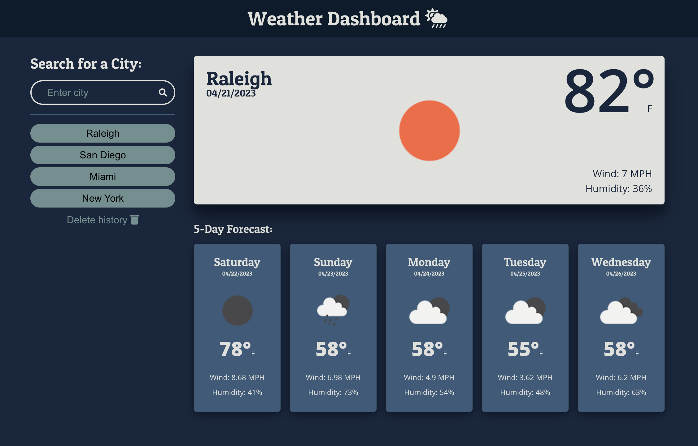

# Server-Side APIs: Weather Dashboard
## Description
A weather dashboard that runs in the browser and features dynamically updated HTML and CSS. It fetches weather data using OpenWeather's API. It saves your search history of in local storage.
## Installation
N/A
## Usage
Open [this website](https://skywalkah.github.io/work-day-scheduller/) in Chrome. Enter a city in the input, click the magnifying glass or hit enter. Open Developer tools console to look for errors. Try entering different cities, then click on previously entered cities to load their weather data again.
## What it should look like

## Credits
[Meyerweb reset](https://meyerweb.com/eric/tools/css/reset/)

## License
MIT license - Please refer to the LICENSE in the repo for more info.
